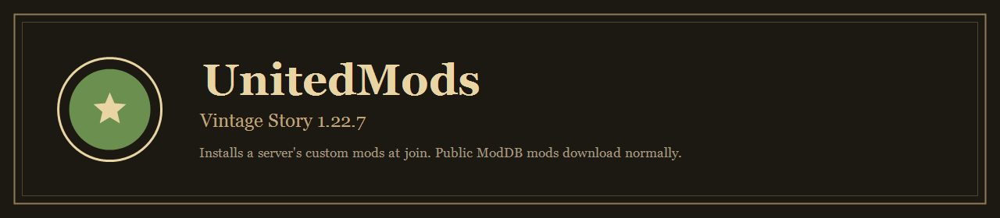

  

  
  
  

**UnitedMods** installs a server's extra mods when you join. Public mods still install from [ModDB](https://mods.vintagestory.at/). Mods that are not on ModDB are downloaded from the server instead.

## Play

1. Install [Vintage Story 1.22.7](https://www.vintagestory.at/).
2. Install [UnitedMods](https://mods.vintagestory.at/unitedmods) into `%APPDATA%\VintagestoryData\Mods`. You can also use [`UnitedMods-v1.0.3.zip`](mods/UnitedMods-v1.0.3.zip) from this repo.
3. Join **A New Life** at `70.70.29.116:42420`.
4. Accept the extra-mod download if the game asks.

That is the whole client setup. The game fetches public mods from ModDB. UnitedMods fetches the rest from the server.

## Mods on A New Life

| Mod | What it does |
| --- | --- |
| **UnitedMods** | Join helper. Required on the client and the server. |
| **Auto Map Markers** | Map markers for ores, traders, and other finds. Stays **off** until you press **Ctrl+Shift+M**. |
| **ImGui** | In-game UI used by other mods' menus. |
| **ConfigLib** | Settings button in the escape menu. |
| **AutoConfigLib** | Config helpers used by Auto Map Markers. |
| **Better Ruins** | World-gen ruins and loot. |
| **BloodTrail** | Animals leave blood when injured. |
| **Footprints** | Players and animals leave prints on soft ground. |
| **BloodTrail Persist** | Optional. Blood pools stay after you harvest an animal. |

Better Ruins, BloodTrail, ConfigLib, and Footprints come from ModDB when you join. UnitedMods then installs Auto Map Markers, ImGui, and AutoConfigLib from the server.

## Files

| File | Version |
| --- | ---: |
| [UnitedMods-v1.0.3.zip](mods/UnitedMods-v1.0.3.zip) | 1.0.3 |
| [AutoMapMarkers-5.0.4.zip](mods/AutoMapMarkers-5.0.4.zip) | 5.0.4 |
| [vsimgui_1.2.8.zip](mods/vsimgui_1.2.8.zip) | 1.2.8 |
| [autoconfiglib_2.0.11.zip](mods/autoconfiglib_2.0.11.zip) | 2.0.11 |
| [configlib_1.13.2.zip](mods/configlib_1.13.2.zip) | 1.13.2 |
| [bloodtrailpersist_1.0.0.zip](mods/bloodtrailpersist_1.0.0.zip) | 1.0.0 |
